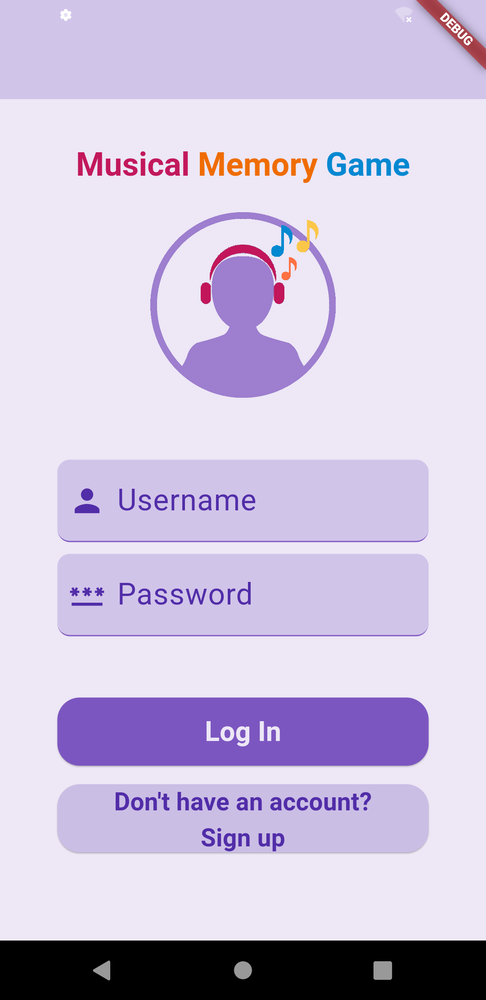
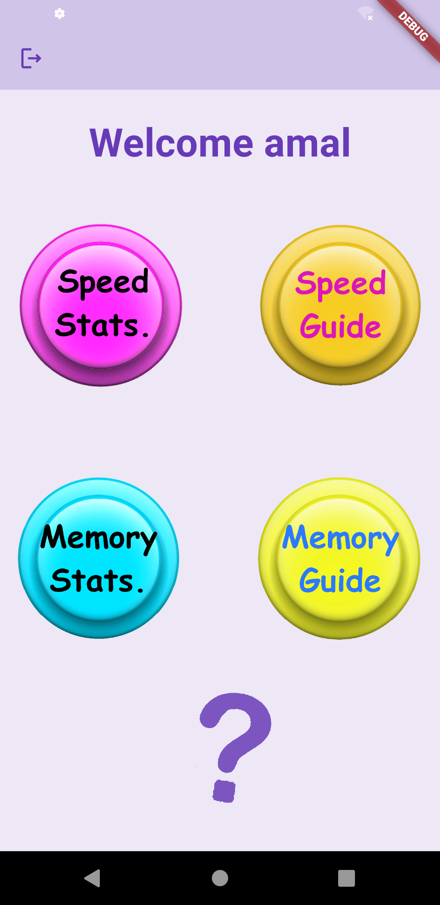
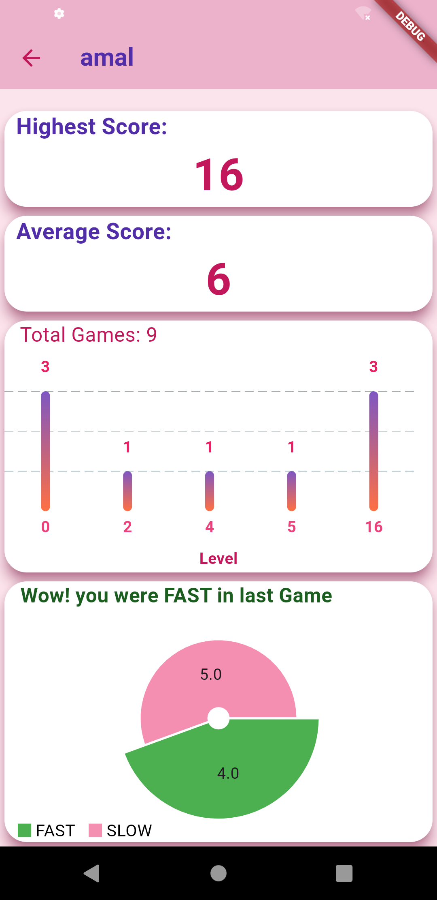

# Musical Memory Game Project
Shaza , Amal and Mariam developing a musical memory game in IOT course at Technion.

Welcome to the Musical Memory Game project repository! This innovative project features a musical memory game with two engaging modes:
1. A musical memory game with a random sequence for users to follow.
2. A speed game mode where users must press the "on" button as quickly as possible.

Users can track user statistics through a companion Flutter app, enhancing the interactive experience.

## Folder Structure:
This repository is organized into several key directories:

- **/memory game:** Main source code for the project.
- **/iot_memory_app:** Contains flutter app source code.
- **/Unit tests:** Basic tests for our game components.
- **/assets:** Audio files used for the project and 3D printed parts.

## Materials List:
Here's a comprehensive list of the hardware components used in this project, including quantities:

- ESP32 Board: 1 unit
- Push Buttons: 4 units
- LEDs: 4 units
- Resistors: 4 units
- Speaker: 1 unit
- MP3 Player: 1 unit
- Neopixel Ring: 1 unit
- Switch: 1 unit

## Libraries and Versions:
For this project, we utilized the ESP32 microcontroller, programming them with several libraries to ensure smooth gameplay and functionality.
- **Visual Studio Code:** @^1.85.2
- **Platform IO Extention**
- **Flutter SDK:** @^3.19.5
- **ESP32 Board:** esp32doit-devkit-v1
- **Libraries:**
  - **adafruit/Adafruit:**  NeoPixel@^1.12.0
  - **rupakpoddar/ESP32:** Firebase@^1.0.0
## Final Connections Diagram:
Below is the final and accurate connections diagram for the project, following our guidelines.

## App Screens:
Take a look at our flutter app for the musical memory game

      

## Project Poster:
Take a look at our project poster for a visual summary of the Musical Memory Game.

Thank you for visiting our project repository. Feel free to explore the code and resources provided. If you have any questions, comments, or suggestions, please don't hesitate to reach out to our team.
